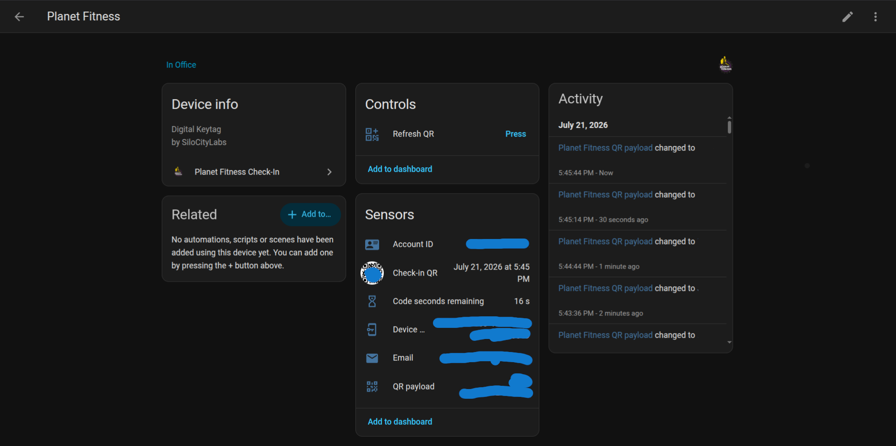

# Planet Fitness Check-In for Home Assistant

Custom [Home Assistant](https://www.home-assistant.io/) integration that generates your Planet Fitness **digital keytag / check-in QR code** without the mobile app. My goal towards an app free life has me creating hacs for apps that are forced for some services.

Setup uses the same Auth0 **email code** login as the official app. After setup, QR codes are computed **locally** (TOTP) — no continuous API polling.

> **Unofficial.** Not affiliated with Planet Fitness. For personal use with your own membership. Gym door scanners and account policies can change without notice.

## Screenshot



---

## Features

| Feature | Details |
|--------|---------|
| Config flow login | Enter membership email → integration waits for the emailed 6-digit code |
| Stored credentials | Email, Auth0 tokens, `accountId`, and `deviceId` saved on the config entry |
| Sensors | Email, Account ID, Device ID, QR payload, seconds remaining on the TOTP window |
| QR image | PNG `image` entity for Lovelace dashboards |
| Refresh button | Forces a local QR regenerate (does **not** call Planet Fitness APIs) |
| Local TOTP | Payload format `{AccountId}:{6-digit-TOTP}` matching the official app |
| Black Card guests | One extra device per guest: approve (unlock) / lock, guest keytag QR, payload sensor |
| Check-in history | Rolling 365-day count, last check-in timestamp, recent visits as attributes |

---

## How the QR works

The official app picks a format from `UserDetails.NewGenUser`:

| Account | App logic | Payload |
|--------|-----------|---------|
| **NewGen** (`NewGenUser == true`) | `AccountId` + TOTP from `DeviceId` | `{AccountId}:{6-digit-TOTP}` |
| **Legacy** (`NewGenUser` false) | `Membership.AbcBarcode` + channel/time suffix | `{AbcBarcode}/mobile/{MMddyyyy-HHmmss}` (UTC) |

Legacy details (from `KeytagService.ExtendQrCodeIfNeeded`):

- Append `/mobile` when the club POS wants a channel source (`QRCodeSuffix.Mobile`)
- Append `/{timestamp}` when `EnableQrCodeSuffix` is on — format `MMddyyyy-HHmmss` in **UTC**

Home Assistant defaults to **Auto** (follows the `NewGenUser` flag from login). Override under **Configure** on the integration:

- Auto (detect)
- NewGen TOTP
- Legacy `/mobile/{timestamp}`
- Legacy barcode only

After the one-time login, regenerating the QR never hits `api.planetfitness.com`. For older installs that only stored TOTP fields, open **Configure**, set format to **Legacy — mobile**, and paste your `AbcBarcode` if needed (the number before `/mobile/` in the official app QR).

---

## Black Card guests

If your membership has Black Card guest passes, each guest shows up as its own device linked to your check-in device.

| Entity type | Name | Purpose |
|-------------|------|---------|
| `switch` | Club access | On = guest unlocked (approved) for club access |
| `image` | Guest QR | Guest keytag QR, available while unlocked |
| `sensor` | Guest QR payload | The scanned string, with the raw barcode as an attribute |
| `sensor` | Guests | Guest count on the main device, with names/status attributes |
| `button` | Refresh guests | Re-reads the guest list immediately |

How it maps to the app:

- `GET /black-card/guest` lists guests (`givenName`, `familyName`, `accessClub`).
- `PUT /black-card/guest/{userId}/unlock` approves a guest **and** is the only call that returns their `barcode` — the app does this every time you tap a guest, and so does the switch.
- `PUT /black-card/guest/{userId}/lock` revokes access.
- Guest QR uses the legacy keytag format: `{barcode}/mobile/{MMddyyyy-HHmmss}` (UTC), or plain barcode if you picked **Legacy barcode only**.

The guest list is polled every 5 minutes; QR payloads re-render locally on the same 30-second tick as your own keytag. Guests enrolled in the Unified Club Pass pilot cannot be locked — the API rejects it with `CannotLockAndUnlockPilotGuest`, and the switch will report that error.

---

## Check-in history

Uses the same My Journey endpoint as the official app:

`GET /view/checkins?from&to&pfxMembershipId`

| Entity type | Name | Purpose |
|-------------|------|---------|
| `sensor` | Check-ins | Count in the last 365 days; `checkins` attribute lists recent visits |
| `sensor` | Last check-in | Timestamp of the most recent visit (`last_club` attribute) |
| `button` | Refresh check-ins | Re-reads history immediately |

History polls about once an hour. Older installs without a stored membership id get it backfilled from `/user-details` on the first history refresh.

---

## Requirements

- Home Assistant **2024.6.0** or newer
- A Planet Fitness membership that can sign in with **email code** (Auth0 passwordless)
- A registered `deviceId` on the account (open the official app once while logged in if setup reports “missing device”)

---

## Installation

### HACS (recommended)

1. Install [HACS](https://hacs.xyz/) if needed.
2. **HACS → Integrations → ⋮ → Custom repositories**
3. Add your repository URL (after you push this folder), category **Integration**.
4. Install **Planet Fitness Check-In**.
5. Restart Home Assistant.

### Manual

1. Copy `custom_components/planet_fitness_checkin` into your HA `config/custom_components/` directory.
2. Restart Home Assistant.

Repository layout (same idea as Creality-Control):

```text
pf-hacs/
├── README.md
├── LICENSE
├── hacs.json
└── custom_components/
    └── planet_fitness_checkin/
        ├── __init__.py
        ├── manifest.json
        ├── const.py
        ├── auth.py
        ├── api.py
        ├── totp_qr.py
        ├── config_flow.py
        ├── coordinator.py
        ├── guest_coordinator.py
        ├── history_coordinator.py
        ├── entity.py
        ├── sensor.py
        ├── image.py
        ├── button.py
        ├── switch.py
        ├── strings.json
        └── translations/en.json
```

---

## Configuration (setup wizard)

1. **Settings → Devices & services → Add integration**
2. Search for **Planet Fitness Check-In**
3. Enter your membership **email**
4. Wait for the Auth0 email with a **6-digit code** (check spam)
5. Enter the code in the wizard (the UI waits on this step)
6. On success, the entry stores:
   - `email`
   - `account_id`
   - `device_id`
   - `access_token` / `refresh_token` (from Auth0; not needed for QR generation, but used for Black Card guests)

If the code is wrong or expired, the flow starts a **new** email challenge so you can try again.

---

## Entities created

| Entity type | Name | Purpose |
|-------------|------|---------|
| `sensor` | Email | Membership email |
| `sensor` | Account ID | `AccountId` used in the QR |
| `sensor` | Device ID | TOTP secret source |
| `sensor` | QR payload | Current `{AccountId}:{TOTP}` string |
| `sensor` | Code seconds remaining | Seconds left in the 30s TOTP window |
| `image` | Check-in QR | PNG suitable for dashboards |
| `button` | Refresh QR | Force regenerate payload + PNG locally |
| `sensor` | Guests | Black Card guest count (+ names/status attributes) |
| `button` | Refresh guests | Re-read the guest list from the API |
| `sensor` | Check-ins | Visit count over the last 365 days |
| `sensor` | Last check-in | Most recent club visit timestamp |
| `button` | Refresh check-ins | Re-read check-in history from the API |

Device name: **Planet Fitness (`your@email`)**. Each Black Card guest gets a linked device named **Planet Fitness Guest (`Name`)** — see [Black Card guests](#black-card-guests).

---

## Dashboard example

Add the QR image and an optional refresh button. The image entity updates about every 15 seconds when the TOTP window changes; press **Refresh QR** right before scanning if you want an immediate redraw.

```yaml
type: vertical-stack
cards:
  - type: markdown
    content: |
      ## Planet Fitness check-in
      Code refreshes every 30 seconds. Tap refresh before you scan if needed.
  - type: picture-entity
    entity: image.planet_fitness_your_email_check_in_qr
    camera_view: auto
    show_state: false
    show_name: false
  - type: entities
    entities:
      - sensor.planet_fitness_your_email_qr_payload
      - sensor.planet_fitness_your_email_code_seconds_remaining
      - button.planet_fitness_your_email_refresh_qr
```

> Entity IDs vary with your email / device name. Use the UI entity picker if unsure.

Alternative: **Picture entity** pointing at the `image.*_check_in_qr` entity, or a custom card that shows `sensor.*_qr_payload` as text.

### Refresh behavior (important)

| Action | Hits Planet Fitness API? |
|--------|---------------------------|
| Setup / re-auth (email + code) | **Yes** (Auth0 + `/user-details`) |
| Periodic coordinator tick (30s) | **No** — local TOTP only |
| Press **Refresh QR** | **No** — local regenerate |
| Guest list poll (5 min) / guest switch | **Yes** — `/black-card/guest` |
| Check-in history poll (1 hr) | **Yes** — `/view/checkins` |

---

## Security notes

- Treat the config entry like a membership credential: `device_id` can mint valid door QR codes.
- Prefer HA secrets backups that are encrypted.
- Tokens are stored for re-auth and for the guest endpoints; QR generation itself does not need them after setup.
- This integration is for **your** account only.

---

## Troubleshooting

| Symptom | What to try |
|---------|-------------|
| No email code | Spam folder; wait a minute; submit email again to resend |
| Invalid / expired code | Use the latest email; flow will request a new code after failure |
| Missing device id | Open the official PF app once, open the keytag screen, then re-run setup |
| QR not accepted at club | Confirm you’re a NewGen / non-legacy user; legacy barcodes differ |
| Image blank | Ensure `segno` installed (HA installs requirements from `manifest.json` on first load); check logs |

Enable debug logging:

```yaml
logger:
  default: info
  logs:
    custom_components.planet_fitness_checkin: debug
```

---

## Development

Logic mirrors the reverse-engineered official Android app (Auth0 `login.planetfitness.com`, `connection=email`, mobile API `https://api.planetfitness.com/mobile`).

Local smoke test of TOTP (outside HA):

```bash
python3 - <<'PY'
from custom_components.planet_fitness_checkin.totp_qr import qr_payload
print(qr_payload("YOUR_ACCOUNT_ID", "YOUR_DEVICE_ID"))
PY
```

---

## Disclaimer

Not affiliated with, endorsed by, or supported by Planet Fitness, Inc. Use at your own risk. Membership terms still apply. Door hardware and backend validation are controlled by Planet Fitness and may reject unofficial clients.

## License

Apache License 2.0 — see [LICENSE](LICENSE).
